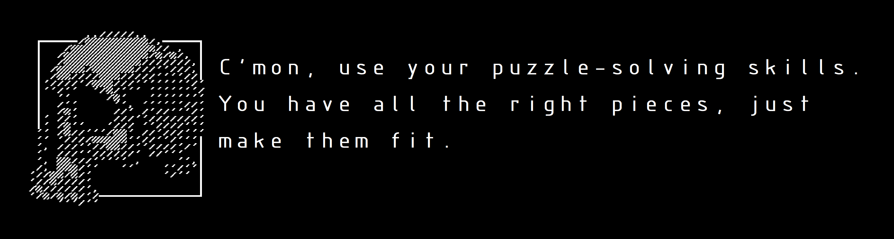

# Skeleton104

## Features:
- Powered by Raspberry Pi Pico
- ANSI 104 layout
- Full RGB with NeoPixel LEDs
- Hot swappable
- South facing switches
- PCB mounted stabilizers
- 2 layer PCB
- I2C pinout for optional expansion

## Repository Contents
- `kicad/` - KiCad schematic and PCB design files. **(currently not present)**
- `gerber/` - Gerber files ready for PCB fabrication.
- `case/` - 3D files for the top (plate) and bottom (case) pieces, provided in STL and SLDPRT formats.

## Notes

This project is still a work in progress. The provided files are functional but not final, and a V2 is currently in development.

## Pictures

*will appear ~~soon~~ sometime...*

## Future Plans
- Add split top and bottom 3D files so they fit standard size 3D printers.
- Add KiCad files.
- Remake the PCB.

## Credits

Big skeleton art made by [Cheese Guy](https://www.artstation.com/cheeseguy)

Small skeleton (or the skeleton in the logo) art made by [littlebitspace](https://littlebitspace.com/)

## License

This project is licensed under the MIT License.
Copyright © 2024 Nojus Balčiūnas
